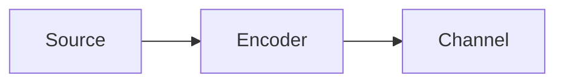

# Compose Docs

Produce outward-facing documentation for a module: a `docs/` folder a *user* of the API can read to learn what the public classes/functions are, how to call them, and how to compose them into a working pipeline.

This is the outward-facing sibling of `project-archaeology`. Archaeology mines *why/how a codebase came to be* into the **Obsidian vault** (evidence tags, git history, causal chains, design rationale) for a future maintainer. Compose-docs extracts the *public API + how to use it* into the **repo's `docs/` folder** for a consumer. Same discipline — phased, source-grounded, scratch-backed — different audience and different output. Do not produce archaeology artifacts here (no evidence tags, no git-history mining, no "why this constant was chosen").

**Invocation:** `/compose-docs [optional/path/to/module]`
- If path omitted, use CWD.
- Output goes to `<repo-root>/docs/` by default. If a `docs/` already exists, update it in place (preserve hand-written content; don't clobber unrelated files).

## Core Principles

1. **Audience is a user, not a maintainer.** Document what someone needs to *call the API and compose a working pipeline*: signatures, parameters, returns, usage, how pieces fit together. Not internal reasoning, not git history, not "why this default was chosen." If a fact only helps a maintainer, it belongs in `project-archaeology`, not here.
2. **Source is ground truth — never document from memory.** Every signature, parameter name, type, default, return value, and property comes from reading the actual source. No interpolation from training data. If you state it in the docs, you read it in the code.
3. **Theory and conventions are RECONSTRUCTED from the code, never recalled.** This is the defining failure mode of outward docs: derivation/convention/coordinate-system/signal-model sections invite you to write textbook domain knowledge that is *plausible but wrong for THIS code*. A sign convention, normalization, or axis order must match what the code actually computes — derive it from docstrings, comments, the literal computation, and any references the repo cites. If you cannot ground a piece of theory in the source, omit it or mark it explicitly as unverified. Pedagogical completeness is never a license to invent.
4. **Usage examples are adapted from the repo's own `examples/` and `tests/`, not invented.** These directories usually mirror the submodule layout (`examples/<sub>/`, `tests/<sub>/`). Lift real, working calls from them and trim to a minimal example. Invented snippets are how wrong signatures and impossible argument combinations get into docs. Every example must be runnable.
5. **Hierarchical, bottom-up composition.** Document leaf units (classes/functions) → compose them into a per-submodule guide → write the hub last so it links guides that already exist. The doc hierarchy mirrors the package hierarchy: hub → submodule guide → class/function reference.
6. **Public surface only.** Document what users import — respect the language's export/visibility mechanism (Python `__init__.py` / `__all__`; JS/TS `export`; Rust `pub`; Go capitalization). Private helpers (Python `_leading_underscore`, unexported names, internal modules not re-exported) are excluded unless they are part of the public contract.
7. **Interactions over inventories.** The highest-value sections are "How the classes interact" and "Data/Signal flow" — how a user wires the pieces into a pipeline. A flat list of classes is a failure; show composition, with concrete shapes/types flowing between stages. When a flow chart or diagram makes the wiring clearer, render it as **mermaid** (preferred — renders natively on GitHub) or **graphviz/DOT** — never ASCII art or an embedded image.
8. **One coherent voice.** Every guide follows the same template, tone, and ordering so the set reads as one document. Consistency is a feature.

## Scratch Workspace

Create scratch files at `/tmp/compose-docs-<module-name>-<timestamp>/` for phase findings — this survives context compaction on multi-submodule packages.

- **Read source read-only in place.** Unlike archaeology, do NOT clone the repo: this skill reads source read-only, runs read-only examples/tests, and writes docs into the repo deliberately. The clone ceremony does not apply.
- If running examples/tests needs isolation (dependency installs), use the project's isolated environment (e.g. a Python venv, a local `node_modules`) or a fresh one — don't mutate global state.
- Scratch holds `phase1-map.md` and `phase2-<submodule>.md` findings, not the final docs.
- **Cleanup:** on success (all guides written, examples verified), delete scratch. On failure or interruption, preserve scratch and print its location.

## Phase 1: Surface Map & Plan

**Goal:** Learn the public surface and the submodule hierarchy. Decide the guide breakdown. Do NOT write reference content yet.

**Steps:**
1. Create scratch workspace.
2. Read the entry points: root `README.md`, the project manifest (Python `pyproject.toml`/`setup.py`; or `package.json`, `Cargo.toml`, `go.mod`, …), and the package's top-level export point (Python `__init__.py`; or `index.ts`, `lib.rs`, …). These define the public surface, the install/quickstart (which guides link to, never duplicate), and the package metadata (name, version). **Identify the language and its conventions here** — they fix the export mechanism, test runner + invocation, and example/test layout used throughout the rest of this skill (the steps below show Python as the worked example).
3. Enumerate submodules — the hierarchy. Each subpackage / source subdirectory (e.g. Python `src/<pkg>/<sub>/`) is a candidate guide. Read each submodule's export point (Python `__init__.py`; or the module's index / `mod.rs` / exported names) to get its *exported* names.
4. For each submodule, list its public classes and free functions (names only at this stage). Note where `examples/<sub>/` and `tests/<sub>/` exist — these feed Phase 2/3.
5. Sketch the cross-submodule relationships: which submodule's output feeds which other's input, and the overall end-to-end flow. This becomes the hub's framing and each guide's "How it interacts" section; any flow chart you render from it ships as mermaid or graphviz (Principle 7).
6. Decide the guide breakdown:
   - One guide per substantial submodule (the common case).
   - Group tiny/closely-related submodules into one guide only if each is too thin to stand alone.
   - Pick `Class Reference` vs `API Reference` framing per guide based on whether it's class-heavy or function-heavy.
7. Plan the hub: one row per guide, each a *dense* one-line description naming the key classes and their distinguishing capabilities (e.g. `GSCBF (LMS tracking, alpha codebook)`, not `beamforming class`).

**Output:** `scratch/phase1-map.md`:
- Language & toolchain: export mechanism, test runner + invocation, example/test layout
- Public surface (top-level exports), package name + version
- Submodule list with exported classes/functions each
- Cross-submodule flow sketch
- Guide breakdown decision (which guides, which framing, any grouping)
- For each submodule: paths to its `examples/` and `tests/` (or "none")

## Phase 2: Per-Submodule Extraction

**Goal:** For each guide, extract everything its reference and usage sections need — strictly from source. Write findings per submodule as you go.

For each submodule, read every public class/function's source and capture:

**a. Exact API.** For each class: the constructor signature verbatim; a constructor-parameters table (name, type, default, one-line description); properties split into read/write vs read-only; a methods table (signature/name, return type, one-line description). For each free function: signature with types and the return type, parameters, what it returns. Copy defaults and types from the code — do not paraphrase them. For non-OOP languages, map class/constructor/properties/methods to the language's equivalents (see **Language Adaptation** below); the copy-don't-paraphrase rule holds regardless.

**b. Theory / conventions the user needs — grounded in the code (Principle 3).** Only the parts a *caller* must know to use the API correctly: signal models, derivations of a computed quantity, coordinate systems, sign/axis/normalization conventions, units, array-shape conventions, edge-case scenarios. Reconstruct each from the actual computation, docstrings, comments, and repo-cited references. If the code doesn't justify a claim, drop it.

**c. Intra-submodule interaction.** How the classes in this submodule compose — which produces input for which, what's decoupled on purpose, the order of operations.

**d. Typical usage.** Locate the real example(s) in `examples/<sub>/` and the tests in `tests/<sub>/`. Extract minimal working call sequences. Capture distinct workflows as separate variants (a)/(b)/(c) when the submodule supports meaningfully different modes. Note the exact test command that runs this submodule's tests (e.g. `pytest tests/<sub>/`, `npm test`, `cargo test`, `go test ./...`).

Write each submodule's findings to `scratch/phase2-<submodule>.md` as you finish it (compaction safety). The section menu — what a guide may contain — is in **Guide Template** below; not every section applies to every submodule.

## Phase 3: Verification

**Goal:** Every signature and every example is correct. Outward docs that don't run are worse than none.

**Steps:**
1. Read all `scratch/phase2-*.md`.
2. **Run the usage examples.** Execute the example scripts in `examples/<sub>/` (or the minimal snippets you derived) against the installed/importable package. If a snippet doesn't run, fix it until it does — the broken version never ships.
3. **Cross-check signatures.** Confirm every parameter/default/return you recorded matches the source (re-read or introspect). Reconcile any drift.
4. **Run the tests** you'll cite in "Running Tests" so the documented commands are real and pass (or note known-skips honestly).
5. For anything that genuinely cannot be executed (needs network, hardware, secrets), keep the example but mark the precondition explicitly (e.g. "requires a configured `spacetrack_config.json`").
6. Record outcomes in `scratch/phase3-verify.md`: what ran, what was fixed, what's gated on a precondition.

## Phase 4: Composition

**Goal:** Write the guides from scratch findings, then the hub. Bottom-up: guides first (they're self-contained), hub last (it links them).

**Steps:**
1. For each submodule, write `docs/<submodule>.md` using the **Guide Template**, filled from its `phase2-<submodule>.md` and verified examples.
2. Add cross-guide links where a flow crosses submodules (e.g. modulation output feeds channel — link `channel.md`). Concrete links, not "see also."
3. Write `docs/README.md` (the hub) last, using the **Hub Template** — one dense row per guide that now exists, plus a pointer to the root README for install/quickstart.
4. Final consistency pass: every guide has the same top-level ordering, the same tone, a working "Running Tests" block, and at least one runnable example. Fix drift.
5. **Validate the template against a structurally different guide.** Before declaring done, confirm the template's optional sections were rich enough — a theory-heavy guide (signal model + sign convention + scenarios) and a flow-heavy guide (coordinate systems + data flow) should both fit cleanly. If one didn't, the template guidance needs the missing section.
6. Cleanup: delete scratch on success; preserve and report its path on any failure.

## Guide Template

`docs/<submodule>.md`. The section list is a **menu ordered by convention**, not a fixed sequence — include the optional sections a submodule warrants, drop the ones it doesn't. Overview, API Reference, Typical Usage, and Running Tests are effectively always present.

```markdown
# <package> — <Submodule> Submodule Guide

<one-paragraph intro: what this submodule covers, in plain terms>

---

## Table of Contents
1. Overview
2. <Theory / Signal Model / Conventions>     (optional — when a caller must know it)
3. Class Reference  (or "API Reference" for function-heavy submodules)
4. How the Classes Interact
5. <Data Flow / Signal Flow>                  (optional — when a multi-stage pipeline)
6. Typical Usage
7. Running Tests
8. References                                  (optional)

---

## 1. Overview
<1–2 paragraphs.> Then a responsibility table:

| Class / Function | Responsibility |
|---|---|
| `Foo` | <one line> |

Note any intentional decoupling ("X handles only A; orchestration lives in the caller").

## 2. <Theory / Conventions>   (optional)
Derivations, signal models, coordinate systems, sign/axis/normalization conventions,
units, shape conventions — RECONSTRUCTED FROM THE CODE (Principle 3). Number the steps
of a derivation. State conventions as the code implements them, not as a textbook would.

## 3. Class Reference
For each class:

### `ClassName`
<one-line purpose>

```
ClassName(arg1, arg2, ...)        # signature verbatim from source
```

#### Constructor Parameters
| Parameter | Type | Default | Description |
|---|---|---|---|

#### Properties (read/write)
| Property | Type | Description |
|---|---|---|

#### Properties (read-only)
| Property | Type | Description |
|---|---|---|

#### Methods
| Method | Returns | Description |
|---|---|---|

For each free function (function-heavy submodules):

### `func(args) -> ReturnType`
<description, parameters, what it returns — types from the signature>

## 4. How the Classes Interact
Prose — which class produces input for which, ordering constraints, what's decoupled.
Add a small diagram only if it clarifies the wiring; when you do, render it as mermaid
(preferred) or graphviz/DOT, never ASCII art:



Cross-link other guides for cross-submodule flow.

## 5. <Data Flow / Signal Flow>   (optional)
Step-by-step pipeline: input → stage → ... → output, with the concrete shapes/types/units
at each hop. This is the most valuable section for pipeline submodules. A mermaid (or
graphviz) diagram of the pipeline pairs well with the prose — keep the per-hop
shapes/types/units in text so they stay greppable.

## 6. Typical Usage
Runnable code blocks adapted from `examples/` / `tests/`. Use lettered variants for
distinct modes:

### (a) <workflow name>
```python
# minimal, runnable
```

### (b) <other workflow>
```python
```

## 7. Running Tests
The project's test command for this submodule (Python shown; use the toolchain from Phase 1):
```bash
python -m pytest tests/<submodule>/ -v
```

## 8. References   (optional)
Papers/specs the implementation cites — only those actually referenced in the source.
```

**Language Adaptation:** The template above is written with a Python/OOP package as the worked example, but the skill is language-agnostic — the hub→guide→reference hierarchy and the source-grounded discipline carry over unchanged. Adapt the surface to the language detected in Phase 1:

- **"Class Reference" → "API Reference"** for function-heavy or non-OOP code. Map constructor/properties/methods to the language's equivalents: Go/C struct + free functions, Rust type + `impl` methods + traits, a functional module's exported functions + types. Drop the property tables entirely where the concept doesn't exist — a single "Functions" or "Types" table is the right shape for procedural/functional code.
- **Export/visibility, manifest, test command, and code-fence language** all follow Phase 1's detected toolchain — not the Python defaults shown above.

Pick one coherent shape per project and hold it across every guide, even where it differs from this Python exemplar.

## Hub Template

`docs/README.md`:

```markdown
# Documentation

Detailed guides for each submodule. For quickstart and installation, see the
[root README](../README.md).

## Guides

| Guide | Description |
|---|---|
| [<sub>.md](<sub>.md) | <dense one-liner: key classes + distinguishing capabilities> |
```

Hub descriptions must be **dense** — name the key classes and what makes each notable, like `MVDRBF (5 modes), GSCBF (LMS tracking, alpha codebook)`. A vague row (`beamforming utilities`) is a defect.

## Anti-Patterns

- **Do NOT document from memory** — read the source for every signature, default, and type.
- **Do NOT write theory/conventions from domain knowledge** — reconstruct them from the code; a convention that contradicts the computation is the worst failure mode of this skill.
- **Do NOT invent usage examples** — adapt real ones from `examples/`/`tests/`, and verify they run.
- **Do NOT expose private/internal helpers** as if they were public API.
- **Do NOT include maintainer archaeology** — no evidence tags, git history, or "why this constant." That's `project-archaeology`.
- **Do NOT produce a flat file-by-file or class-by-class dump** — group by submodule and show how the pieces interact.
- **Do NOT duplicate the root README's install/quickstart** in every guide — link to it.
- **Do NOT write the hub before the guides** — compose bottom-up so the hub only links guides that exist.
- **Do NOT ship an unverified example** — if it can't run, fix it or mark its precondition.
- **Do NOT draw diagrams as ASCII art or embed images** — express every flow chart / diagram as mermaid (preferred, GitHub-native) or graphviz/DOT so it stays source-diffable and renders inline.
- **Do NOT clobber hand-written docs** when updating an existing `docs/` folder.
```
